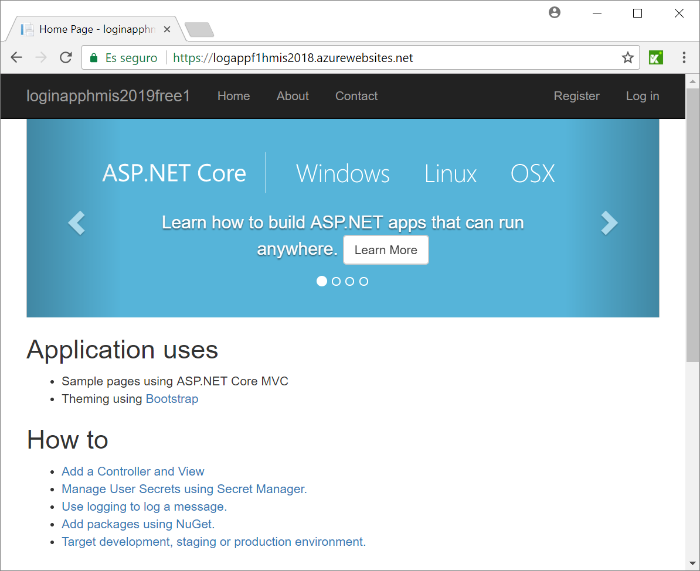

# Ejemplo con Selenium IDE

1. Cargar la Test Suite con Katalon Recorder
  * Requisitos: Tener instalado el plugin  Katalon Recorder (explicado aquí: https://github.com/ualhmis/seleniumIDEejemploClase)
    * Si usas *Katalon Recorder* cargar el test suite: _LoginHmis2018dotNetfree.html_ (version actualizada en inglés de la app _login_.)
  
2. Lanzar los tests (sobre https://logappf1hmis2018.azurewebsites.net/) (Actualizado 2018)

3. Añadir los tests necesarios para probar toda la funcionalidad de la aplicación: 
  * Registro de usuario (Caso correcto - hecho)
  * Registro de usuario (Casos incorrectos - por hacer)
  * Login de usuario (Caso correcto - hecho)
  * Login de usuario (Casos incorrectos - por hacer)
  * Cambio de contraseña de usuario (Caso correcto - por hacer)
  * Cambio de contraseña de usuario (Casos incorrectos - por hacer)
	